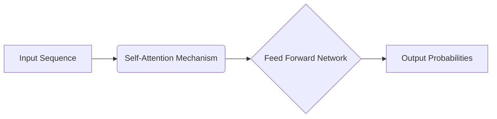

### Introduction

The evolution of Natural Language Processing (NLP) is fundamentally a story of overcoming the constraints of sequence. For decades, the dominant approach to language modeling relied on sequential processing. Recurrent Neural Networks (RNNs) and their more advanced variants, Long Short-Term Memory (LSTM) networks, were the state-of-the-art.

### The Problem with Sequence

Legacy RNNs processed text sequentially, word by word. This meant that the network had to maintain a hidden state that captured the context of all previous words. As the sequence length increased, the network struggled to retain information from the beginning of the sequence, a phenomenon known as the vanishing gradient problem.

### The Transformer Revolution

The Transformer architecture, introduced in the seminal 2017 paper "Attention Is All You Need," completely discarded recurrence. Instead, it relied entirely on a mechanism called self-attention to draw global dependencies between input and output.

